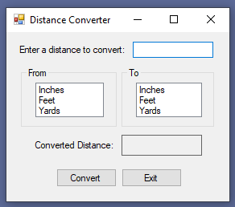

# DistanceConverter

1 Yard = 3 Feet

1 Foot = 12 Inches

Use the image given to lay out your form exactly as shown.
The user must enter a value (decimals allowed) in the text box and then select the original
unit of meaure on the left and the unit to be converted to on the right.

You will need to get the user input from the text box and the list boxes. Be sure to use validation.
Convert to the proper values and display the results, rounding to two decimal places.
Don't forget that the user may select the same 'from' and 'to' values. You should still display the results in that case.

# Evaluation Criteria

Error Checking/Validation
- List box 1 selected
- List box 2 selected
- Text box Tryparse	
- Positive values	
- Nested structure

Lengths converted properly

Results displayed and labeled properly
  
Use of control structures
- Efficient Coding
- Nesting

Format/Readability/Organization

Comments/Documentation

Variables/Control Naming
